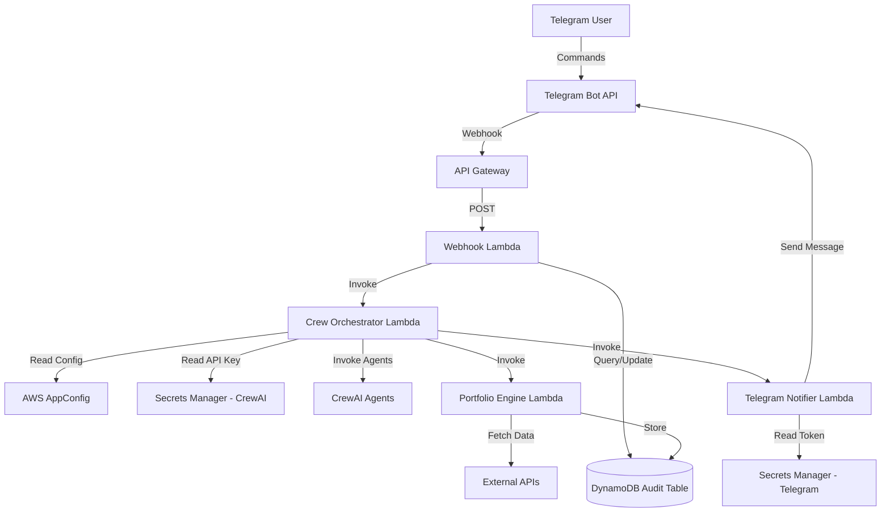

# Cryptonaut - Master Implementation Plan

## Project Overview

Cryptonaut is an AI-powered cryptocurrency portfolio management and analysis system that combines:
- **CrewAI agents** for intelligent market analysis and recommendations
- **Telegram bot** for user interaction and notifications
- **AWS serverless infrastructure** for scalability and reliability
- **DynamoDB** for audit logging and data persistence

## Architecture

### High-Level Components



### AWS Resources

#### Secrets Manager
- **Telegram Bot Secret** (`cryptonaut/telegram-bot`)
  - Stores Telegram Bot Token
  - Used by: Webhook, Notifier
- **CrewAI API Key** (`cryptonaut/crewai-key`)
  - Stores CrewAI API credentials
  - Used by: Orchestrator

#### AppConfig
- **Application**: `cryptonaut-app`
- **Environment**: `production`
- **Configuration Profile**: Hosted configuration for agent parameters
- Used by: Orchestrator, Portfolio Engine

#### DynamoDB
- **Table**: `cryptonaut-audit-table`
- **Schema**: 
  - Partition Key: `pk` (STRING)
  - Sort Key: `sk` (STRING)
- **Features**: Point-in-time recovery, AWS-managed encryption
- **Purpose**: Audit logging, user state, portfolio data

#### Lambda Functions

1. **Crew Orchestrator** (`cryptonaut-orchestrator`)
   - **Purpose**: Orchestrates CrewAI agent execution
   - **Triggers**: API Gateway, EventBridge
   - **Permissions**: DynamoDB Write, Secrets Read (CrewAI), AppConfig Read, Invoke Notifier
   - **Timeout**: 60 seconds

2. **Telegram Notifier** (`cryptonaut-notifier`)
   - **Purpose**: Sends notifications via Telegram
   - **Triggers**: Orchestrator invocation
   - **Permissions**: DynamoDB Write, Secrets Read (Telegram)

3. **Telegram Webhook** (`cryptonaut-webhook`)
   - **Purpose**: Receives and processes Telegram updates
   - **Triggers**: API Gateway (Telegram webhook)
   - **Permissions**: DynamoDB Read/Write, Secrets Read (Telegram)

4. **Portfolio Engine** (`cryptonaut-portfolio`)
   - **Purpose**: Fetches and analyzes portfolio data
   - **Triggers**: Orchestrator, API Gateway
   - **Permissions**: DynamoDB Read, AppConfig Read

## Implementation Status

### Phase 1: Infrastructure Foundation ✅

- [x] **CDK Setup**
  - [x] Basic CDK project structure
  - [x] TypeScript configuration
  
- [x] **Core Constructs**
  - [x] `AuditTable` - DynamoDB table construct
  - [x] `AppSecrets` - Secrets Manager construct with props interface
  - [x] `AppConfig` - AWS AppConfig construct (Application, Environment, Profile)

- [x] **Lambda Scaffolding**
  - [x] Directory structure for 4 Lambda functions
  - [x] Placeholder handlers with logging
  - [x] Environment variable configuration

### Phase 2: Stack Wiring ✅

- [x] **CryptonautStack Integration**
  - [x] Import all constructs
  - [x] Wire Lambda functions with proper configuration
  - [x] Configure IAM permissions and resource grants
  - [ ] Add API Gateway for webhook endpoint (Phase 4)

- [x] **Verification**
  - [x] `cdk synth` passes
  - [ ] `cdk deploy` to AWS account (ready when credentials obtained)
  - [ ] Manual testing of resource creation

### Phase 3: Lambda Implementation 📋 (Planned)

#### Orchestrator Lambda
- [ ] Implement CrewAI agent initialization
- [ ] Configure agent roles and goals
- [ ] Implement analysis workflow
- [ ] Add error handling and retries
- [ ] Integrate with AppConfig for dynamic configuration

#### Notifier Lambda
- [ ] Implement Telegram Bot API client
- [ ] Message formatting and templating
- [ ] Rate limiting and queue management
- [ ] Error handling for failed sends

#### Webhook Lambda
- [ ] Telegram webhook validation
- [ ] Command parsing and routing
- [ ] User authentication and authorization
- [ ] Request/response mapping to DynamoDB

#### Portfolio Engine
- [ ] Exchange API integration (Binance, Coinbase, etc.)
- [ ] Portfolio valuation logic
- [ ] Historical data tracking
- [ ] Performance metrics calculation

### Phase 4: API Gateway & Integration 📋 (Planned)

- [ ] Create API Gateway REST API
- [ ] Configure webhook endpoint `/telegram/webhook`
- [ ] Set up custom domain (optional)
- [ ] Configure CORS and throttling
- [ ] Register webhook with Telegram

### Phase 5: CrewAI Agents 📋 (Planned)

- [ ] **Market Analyst Agent**
  - Research and analyze market trends
  - Identify opportunities and risks

- [ ] **Portfolio Manager Agent**
  - Evaluate current holdings
  - Generate rebalancing recommendations

- [ ] **Risk Assessor Agent**
  - Calculate risk metrics
  - Provide risk warnings

- [ ] **Reporter Agent**
  - Synthesize analysis from other agents
  - Generate human-readable reports

### Phase 6: Monitoring & Operations 📋 (Optional)

- [ ] CloudWatch dashboards
- [ ] Log aggregation and analysis
- [ ] Alarms for failures and anomalies
- [ ] Cost monitoring and optimization
- [ ] Backup and disaster recovery

## Current Implementation Plan

### Immediate Next Steps

1. **Complete Stack Wiring**
   ```typescript
   // Create & Import AppConfig and its unit tests.
   // Create & Import AppSecrets and its unit tests.
   // Configure environment variables
   // Import AuditTable and its unit tests.
   // Set up IAM permissions
   ```

2. **Deploy Infrastructure**
   ```bash
   cd cdk
   npx cdk synth    # Verify template
   npx cdk deploy   # Deploy to AWS
   ```

3. **Configure Secrets** (Manual)
   - Add real Telegram Bot Token to `cryptonaut/telegram-bot`
   - Add real CrewAI API Key to `cryptonaut/crewai-key`

4. **Verify Deployment**
   - Verify DynamoDB table exists
   - Confirm Secrets Manager secrets present
   - Test basic Lambda invocations

## Future Enhancements

- **Multi-user support**: User authentication and per-user data isolation
- **Scheduled analysis**: EventBridge rules for periodic portfolio checks
- **Web dashboard**: React frontend for portfolio visualization
- **Advanced analytics**: Machine learning models for price prediction
- **Multi-chain support**: Ethereum, Solana, and other blockchain integrations
- **Backtesting**: Historical strategy performance evaluation

## Development Workflow

### Local Development
```bash
# Install dependencies
cd cdk && npm install
cd ../lambdas && pip install -r requirements.txt

# Run tests
cd lambdas && pytest

# Synthesize CDK
cd cdk && npx cdk synth
```

### Deployment
```bash
# Deploy to AWS
cd cdk && npx cdk deploy

# Bootstrap (first time only)
npx cdk bootstrap
```

### Testing
```bash
# Unit tests
pytest lambdas/tests/

# Integration tests
pytest lambdas/tests/integration/

# Invoke Lambda locally
sam local invoke CrewOrchestrator -e events/test-event.json
```

## Security Considerations

- **Secrets**: Never commit credentials to version control
- **IAM**: Principle of least privilege for all Lambda roles
- **Encryption**: All data encrypted at rest and in transit
- **API Security**: Validate Telegram webhook signatures
- **Rate Limiting**: Prevent abuse via API Gateway throttling

## Cost Estimation

### Realistic Low-Volume Usage (100-500 requests/month)

**Within AWS Free Tier (First 12 months):**
- Lambda: **$0** (Free tier: 1M requests + 400K GB-seconds)
- API Gateway: **$0** (Free tier: 1M requests for 12 months)
- DynamoDB: **$0** (Free tier: 25 GB storage, 25 RCU/WCU)
- Secrets Manager: **$0.80** (2 secrets × $0.40/month - no free tier)
- AppConfig: **$0** (Free tier covers light usage)
- **Total: ~$1/month**

**After Free Tier Expires:**
- Lambda: **$0** (100-500 requests is negligible)
- API Gateway: **$0.35** (100 requests × $3.50/million)
- DynamoDB: **$0** (on-demand pricing, minimal reads/writes)
- Secrets Manager: **$0.80** (2 secrets × $0.40/month)
- AppConfig: **$0** (minimal configuration retrievals)
- **Total: ~$1-2/month**

> **Note**: Costs scale with usage. The above assumes personal/development usage with <500 Lambda invocations monthly.

## Contributing

1. Create feature branch from `main`
2. Implement changes with tests
3. Run `cdk synth` to verify
4. Create production-grade commits
5. Open pull request with detailed description

## License

[To be determined]
